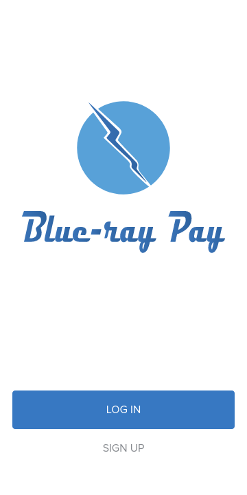
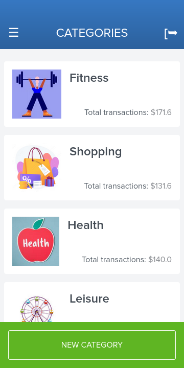

<a name="readme-top"></a>

# 📗 Table of Contents

- [📖 About the Project](#about-project)
  - [🛠 Built With](#built-with)
    - [Tech Stack](#tech-stack)
    - [Key Features](#key-features)
  - [🚀 Live Demo](#live-demo)
- [💻 Getting Started](#getting-started)
  - [Setup](#setup)
  - [Prerequisites](#prerequisites)
  - [Install](#install)
  - [Usage](#usage)
  - [Run tests](#run-tests)
  - [Deployment](#triangular_flag_on_post-deployment)
- [👥 Authors](#authors)
- [🔭 Future Features](#future-features)
- [🤝 Contributing](#contributing)
- [⭐️ Show your support](#support)
- [🙏 Acknowledgements](#acknowledgements)
- [❓ FAQ (OPTIONAL)](#faq)
- [📝 License](#license)

<!-- PROJECT DESCRIPTION -->

# 📖 Blue-ray Pay <a name="about-project"></a>

**Blue-ray Pay** is a classic example of a payment tracking application, built using the Ruby on Rails Frawework.
The application is a fully functional app that allows users to sign-up/log-in, create different categories & create different transactions that belong to one or many categories.


## 🛠 Built With <a name="built-with"></a>

### Tech Stack <a name="tech-stack"></a>

- Ruby
- Ruby on Rails
- Postgresql (Database)
- Haml
- Tailwind
- RSpec & Capybara for testing

### Key Features <a name="key-features"></a>

- Athentication (using devise)
- Image upload, validation & processing (using "shrine" & "image_processing" gems)
- Responsive design with tailwind

<p align="right">(<a href="#readme-top">back to top</a>)</p>

## 🚀 Live Demo <a name="live-demo"></a>

- [Live Demo](https://blue-ray-pay.onrender.com)

## Screenshots

### **Mobile**
  
  
  

### **Desktop**
  
  


<p align="right">(<a href="#readme-top">back to top</a>)</p>

<!-- GETTING STARTED -->

## 💻 Getting Started <a name="getting-started"></a>

To get a local copy up and running, follow these steps.

### Prerequisites

In order to run this project you need:

- Basic knowledge of the command line.
- [Ruby](https://www.ruby-lang.org/en/documentation/installation/) installed on your device.
- [Ruby on Rails](https://guides.rubyonrails.org/v5.0/getting_started.html) installed on your device.
- Postgresql Database, you can follow this [link](https://www.postgresql.org/download/), choose your system & follow the provided instructions.
- [ImageMagic](https://imagemagick.org/script/download.php) installed on your device for manipulating the uploaded image via the "image_processing" gem.

### Setup

Clone this repository to your desired folder:

```sh
  cd my-folder
  git clone git@github.com:Peter1907/blue-ray-pay.git
```

### Install

Install this project with:
```sh
  cd blue-ray-pay
  bundle install
```

Install tailwindcss gem to work properly:
```sh
  rails tailwindscss:install
```

### Usage

To run the project, execute the following command:


- To run the project in your browser, run:
```sh
  rails server
```
Or for short:
```sh
  rails s
```

- if you want to modify styles & let tailwind compile on save run:
```sh
  rails tailwindcss:watch
```

### Run tests

- You would have the necessary gems added to the Gemfile
- Open the terminal in the repo folder on your machine & run `bundle install` if you haven't already done so by this point
- In the terminal you have the option to run the tests for:
  - An entire folder, using the `rspec spec` command.
  - A sub-folder, using the `rspec spec/models` for example.
  - A single file, using the `rspec spec/requests/post_spec.rb` for example.

<p align="right">(<a href="#readme-top">back to top</a>)</p>

## 👥 Authors <a name="authors"></a>

👤 **Peter Beshara**

- GitHub: [@Peter1907](https://github.com/Peter1907)
- Twitter: [@Peter_Beshara_](https://twitter.com/Peter_Beshara_)
- LinkedIn: [LinkedIn](https://www.linkedin.com/in/peter-beshara-b33681241/)

<p align="right">(<a href="#readme-top">back to top</a>)</p>

<!-- FUTURE FEATURES -->

## 🔭 Future Features <a name="future-features"></a>

- **To be added..**

<p align="right">(<a href="#readme-top">back to top</a>)</p>

## 🤝 Contributing <a name="contributing"></a>

Contributions, issues, and feature requests are welcome!

Feel free to check the [issues page](https://github.com/Peter1907/blue-ray-pay/issues).

<p align="right">(<a href="#readme-top">back to top</a>)</p>

## ⭐️ Show your support <a name="support"></a>

Give a ⭐️ if you like this project!

<p align="right">(<a href="#readme-top">back to top</a>)</p>

<!-- ACKNOWLEDGEMENTS -->

## 🙏 Acknowledgments <a name="acknowledgements"></a>

- Microverse for overseeing the project
- Original design idea by [Gregoire Vella on Behance](https://www.behance.net/gregoirevella)
- Inspiration, Dedication

<p align="right">(<a href="#readme-top">back to top</a>)</p>

<!-- LICENSE -->

## 📝 License <a name="license"></a>

This project is [MIT](./LICENSE) licensed.

<p align="right">(<a href="#readme-top">back to top</a>)</p>
